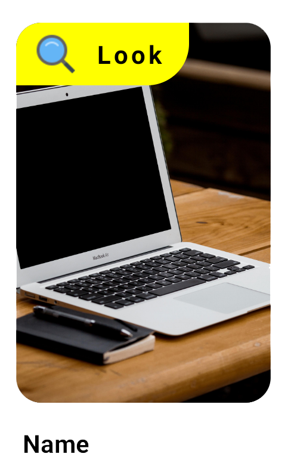
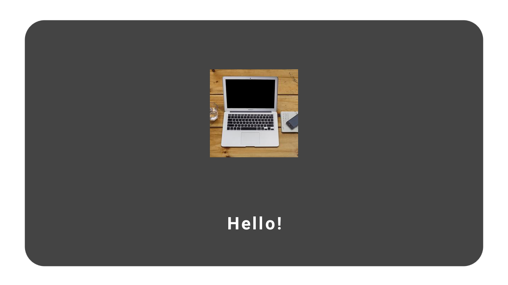
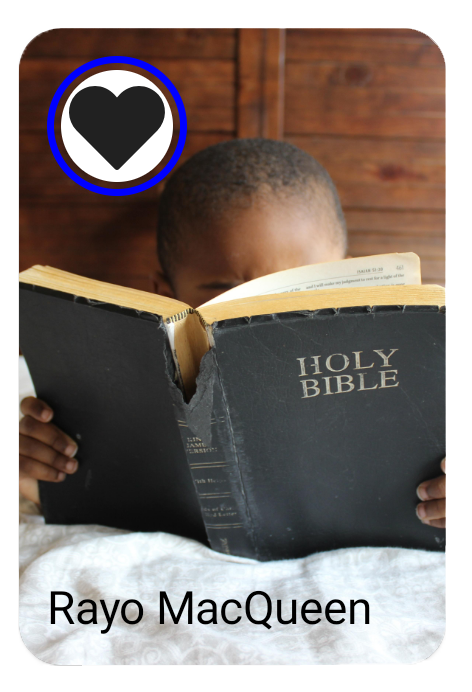

# Cards

This section shows the documentation of those "Composables" that are within the **"Cards"** category of the library. If by any chance you find a bug or want to improve any of these components, do not hesitate to open an **Issue** or **Pull Requests**.

## DebutCard

This composable has been developed for specific characteristics of an application, but it can also be reused. The various parameters, an example and the final result are shown below

> **Params:** modifier, title, image, iconDebut, nameOfDebut, isDebut, bgDebut and navigateToScreen

**Example Code:**

```
    DebutCard(
        title = "Name",
        image = "https://picsum.photos/id/0/5616/3744",
        isDebut = true,
        nameOfDebut = "Look",
        iconDebut = "https://img.icons8.com/color/search",
        bgDebut = Color.Yellow,
        navigateToScreen = { }
    )
```

**Result:**



## InfoCard

This composable has been developed for specific characteristics of an application, but it can also be reused. The various parameters, an example and the final result are shown below

> **Params:** modifier, title, image, textColor, iconResource, iconTintColor and iconImage

**Example Code:**

```
    InfoCard(
        title = "Info",
        iconImage = "https://img.icons8.com/color/search",
        modifier = Modifier
            .clip(RoundedCornerShape(15.dp))
            .background(Color.Blue.copy(.5f)),
        textColor = Color.Black
    )
```

**Result:**


## PostCardTop

This composable has been developed for specific characteristics of an application, but it can also be reused. The various parameters, an example and the final result are shown below

> **Params:** modifier, title, image and description

**Example Code:**

```
    PostCardTop(
        title = "Hello!",
        image = "https://picsum.photos/id/1023/3955/2094",
        description = "The World is a Vampire!"
    )
```

**Result:**


## SectionCard

This composable has been developed for specific characteristics of an application, but it can also be reused. The various parameters, an example and the final result are shown below

> **Params:** modifier, title, textColor, localImage, remoteImage, backgroundCard and navigateToScreen

```
    SectionCard(
        modifier = Modifier.padding(20.dp),
        title = "Hello!",
        remoteImage = "https://picsum.photos/250?image=9",
        backgroundCard = Color.DarkGray,
        textColor = Color.White,
        navigateToScreen = { }
    )
```

**Result:**



## StoryCard

This composable has been developed to displays the same design as Facebook stories. The various parameters, an example and the final result are shown below

> **Params:** modifier, title, textColor, circleImage, iconMainUrl, iconMainResource and navigateToScreen

```
    StoryCard(
        modifier = Modifier.animateItem(),
        title = "Rayo MacQueen",
        iconMainUrl = "https://picsum.photos/id/1010/5184/3456",
        circleImage = R.drawable.ic_btnfavourite,
        navigateToScreen = { }
    )
```

**Result:**

